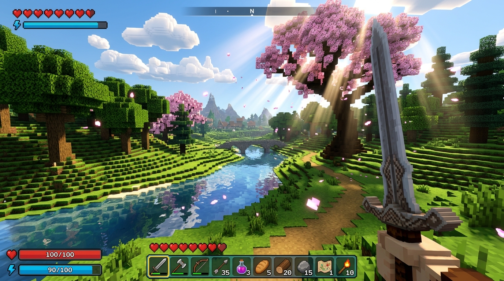
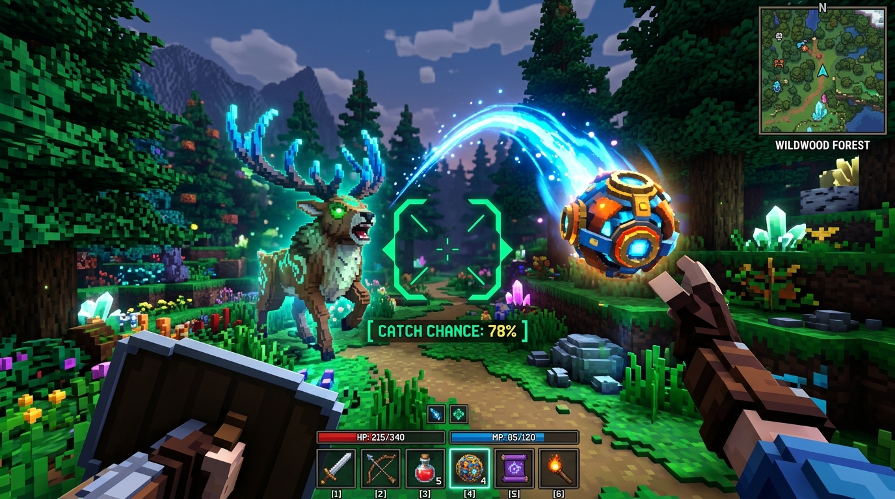
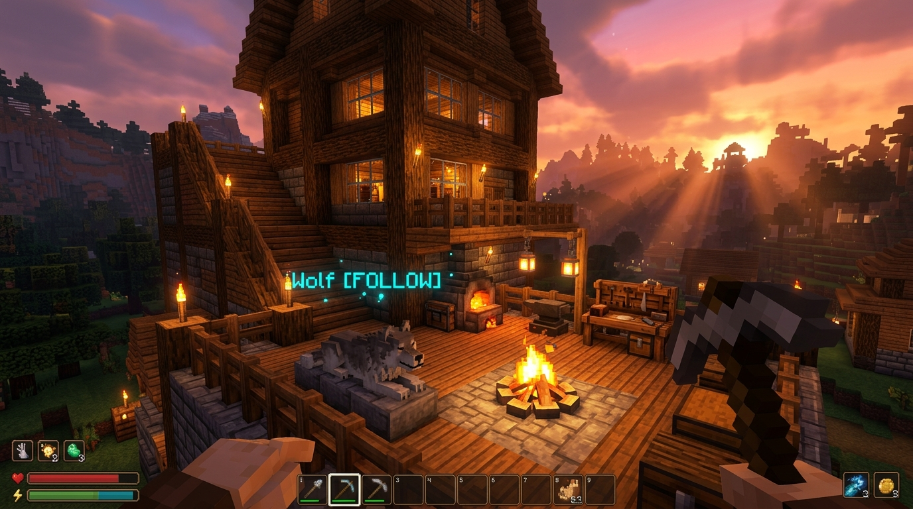

# Chronicles of Aetheria

[](https://github.com/alpdemironder/Chronicles-of-Aetheria/releases)
[](https://opensource.org/licenses/MIT)
[](https://isocpp.org/)
[](https://www.opengl.org/)

An advanced **C++17 OpenGL 3.3 Core Profile Voxel RPG Sandbox** that blends the infinite procedural exploration of Minecraft with the tactical companion taming and modular freeform base building of Palworld.

---

## 📸 Gameplay Gallery


*Lush procedural biomes featuring cherry blossom groves, reflective river systems, and Iris shader atmospheric lighting.*


*Dynamic projectile capture mechanics with ballistic arc physics, real-time catch probability reticle, and mythical creature encounters.*


*Modular multi-tier architectural construction, crafting workshops, and loyal tamed companion wolves guarding the base at golden hour.*

---

## 🌟 Key Features

### 1. 🌍 Procedural Voxel Engine & Worldgen
- **365+ Block IDs** with distinct material properties, step heights, and mining speeds.
- **35 Unique Biomes**:
  - *Temperate*: Lush Meadows, Autumnal Woodlands, Birch Glades.
  - *Arid*: Dune Sea, Red Rock Mesas, Oasis.
  - *Cold*: Frosted Taiga, Glacial Spikes, Alpine Peaks.
  - *Tropical*: Dense Jungle, Bamboo Sanctuary, Mangrove Swamps.
  - *Nocturnal & Volcanic*: Magma Calderas, Obsidian Ridges.
  - *Celestial*: Void Peaks, Ethereal Spires.
- **3D Multi-Octave Caverns**: Subterranean cave systems, winding tunnels, aquifer chambers, and molten magma pools with fluid flow physics.

### 2. 🔮 Creature Ecosystem & Palworld-Style Taming System
- **Farm Animals First (Docile Wildlife & Livestock)**:
  - **Dairy Cow**: White with black patched coat, curved ivory horns, floppy ears, udder, drops Tanned Leather.
  - **Highland Sheep**: Fluffy wool fleece coat, distinct dark face and ears, drops Wool.
  - **Farm Pig**: Rounded pink body, 4 trotters, protruding 3D snout with nostrils, curly tail, drops Savory Feast Meat.
  - **Farm Chicken**: Plump feathered body, flapping wings, yellow beak, bright red comb & wattle, drops Feathers.
  - **Wild Steed (Horse)**: Muscular equine torso, arched neck, dark crest mane, tall hooved legs, flowing tail, rapid 6.5 m/s stride.
- **Monsters (Hostile Foes & Night Terrors)**:
  - **Draugr Zombie**: Decaying necrotic green skin, forward-extended reaching arms, dark sunken eyes, drops Iron Ingots.
  - **Skeleton Archer**: Ivory bone structure, exposed ribcage, hollow sockets, wields a recurve bow, drops Bone Meal.
  - **Cave Spider**: Dedicated 8-legged articulated arachnid model with ripple-wave crawling gait, 6 glowing ruby eyes, venomous pedipalp fangs, drops Silk Rope.
  - **Crypt Ghoul**: Gaunt ashen-purple predatory fiend, hunched feral posture, elongated arms with razor black talons, protruding spinal bone ridges, glowing amber eyes.
  - **Goblin Raider**: Short green skirmisher, large pointed bat ears, upward underbite tusks, wields a jagged iron dagger, drops Gold Ingots.
- **Physical 3D Capture Sphere Projectiles**:
  - Pal Sphere (1.0x capture power)
  - Mega Sphere (2.0x capture power)
  - Giga Sphere (3.5x capture power)
  - Arcing throw physics with parabolic gravity and drag. Missed spheres land safely and can be recovered by walking over them.
- **3-Stage Wobble Capture Sequence**:
  - Capturing weakened wild creatures pulls them into a physical 3D sphere.
  - 3 successive tension-filled wobble checks ($t = 0.8\text{s}$, $1.6\text{s}$, $2.4\text{s}$) with audio cues and rolling animations.
  - Capture probability dynamically scales with remaining health ($1.0 - 0.72 \times \text{HP}\%$).
- **Dynamic Capture Reticle**: Aiming at wild creatures displays real-time calculated catch chance (`[ CATCH CHANCE: XX% ]`) with color-coded feedback.
- **Companion Stance Management (`[V]` Key)**:
  - `[FOLLOW & DEFEND]`: Follows master, teleports if stranded, and attacks hostile enemies.
  - `[STAY / GUARD]`: Holds position and defends a 4-block perimeter.
  - `[WORK AT BASE]`: Patrols and works inside player base camp boundaries.
- **Companion Progression**: Earns XP from monster defeats, levels up, increases Max HP and Attack Damage, and regenerates health out of combat.
- **Companion HUD Deck**: Displays companion level, HP bar, active stance, and overhead crown badges.

### 3. 🏰 Palworld Freeform Modular Building
- **16 Modular Architectural Pieces**: Foundations, walls, doorframes, stairs, roofs, workbenches, furnaces, and base camp totems.
- **Interactive Hologram Ghost Preview**: Precision placement, 90° piece rotation (`[R]`), and dismantle mode (`[X]`) with material recycling.

### 4. ⚔️ Minecraft 1.9+ PvP Combat Mechanics
- **Attack Speed Cooldowns & Recharge Meter**: Weapon-specific recovery speeds (Iron Broadsword, Battleaxes, Daggers) with visual HUD attack charge indicator beneath crosshair.
- **Quadratic Scaling**: Quick click spamming deals minimal damage; charged strikes deliver full damage and heavy knockback.
- **Critical Strikes**: Striking opponents during downward fall grants $+50\%$ critical bonus damage with crisp particle and audio feedback.

### 5. ☀️ 12-Minute Day/Night Cycle & Iris Shaders
- **Solar & Lunar Celestial Arcs**: Smooth orbital sun/moon movement with dynamic atmospheric fog and horizon transitions.
- **Iris Shaders Engine**: Dual G-Buffer deferred pipeline with volumetric fog, screen-space tonemapping, and in-game shader switcher menu (`[O]`).

---

## 🚀 Building & Running

### Requirements
- **OS**: Windows 10/11 (64-bit)
- **Compiler**: GCC 9+ (MinGW-w64) or MSVC with C++17 support
- **Graphics**: OpenGL 3.3 Core Profile compatible GPU

### Compile from Source
```cmd
build.bat
```
The executable will be built directly to `bin\AetheriaRPG.exe`.

### Controls
| Key | Action |
|-----|--------|
| **W, A, S, D** | Move / Strafe |
| **Space** | Jump / Swim upward |
| **Left Shift** | Sprint |
| **Left Ctrl** | Sneak |
| **R** | Dash / Rotate building piece |
| **C** | Telescopic Zoom (3.1x) |
| **Left Click** | Attack / Mine Voxel |
| **Right Click** | Throw Pal Sphere / Place Block / Use Consumable |
| **E / Tab / I** | Open Inventory & Crafting Table |
| **V** | Cycle Companion Stance (`Follow` -> `Stay` -> `Work`) |
| **F** | Hammer Blueprint Scaffold |
| **B** | Palworld Building Menu |
| **X** | Dismantle Mode |
| **O** | Iris Shaderpack Menu |
| **Esc** | Pause / Settings Menu |

---

## 📜 License
Distributed under the MIT License. See `LICENSE` for details.
